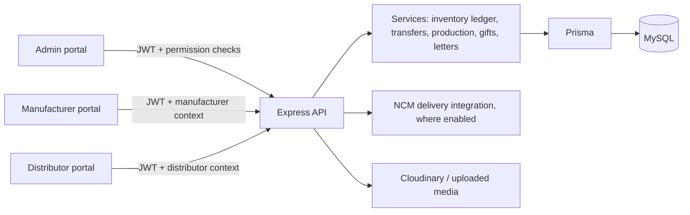

# Manufacturer, Distributor, and Admin Operations Guide

This guide documents the current implementation in this repository. The API is a
Node.js/Express service using Prisma and MySQL. Database models and relations are
defined in [`backend/prisma/schema.prisma`](./backend/prisma/schema.prisma), route
mounts in [`backend/server.js`](./backend/server.js), and route-level permission
checks in `backend/routes/` and `backend/middleware/unifiedAuth.js`.

> **Scope note:** “Distributor requests goods from manufacturer” is currently a
> bulk stock-transfer workflow, not a distributor purchase-order/payment
> workflow. The distributor submits a request, an admin approves quantities,
> the manufacturer dispatches the approved goods, and the distributor records
> receipt. The code does not expose a manufacturer accept/reject step for these
> bulk requests.

## 1. System architecture

- `backend/server.js` mounts the business API beneath `/api`.
- Authentication resolves an `AuthAccount` and its active role grants. Route
  handlers generally use `authorize("<permission-code>")`.
- Manufacturer/distributor routes additionally bind the request to the
  authenticated account's profile using `setManufacturerContext` or
  `setDistributorContext`; client-supplied profile IDs are not trusted as the
  acting identity.
- `InventorySku`, `InventoryLocation`, `InventoryBalance`, and
  `InventoryLedgerEntry` form the location-based stock ledger used by
  distributor transfers and production receipts. `StockLog` and
  `ManufacturerInventory` are also present as older/product-level inventory
  structures. They should not be interpreted as equivalent to the SKU/location
  ledger.
- This repository contains separate customer-order fulfillment assignments
  (`OrderAssignment`) and bulk distributor stock transfers (`StockTransfer`).
  The two flows have different actors, statuses, and endpoints.

## 2. Roles, authentication, and permissions

### Roles and grants

`AuthAccount.role` is a legacy primary-role value. The effective grants can be
stored in:

| Table | Purpose |
|---|---|
| `AuthAccount` | Login identity, password hash, account status and security state. |
| `Role` | Named role code, portal scope and active flag. Typical portal role codes are `ADMIN`, `MANUFACTURER`, `DISTRIBUTOR`, `CUSTOMER`, and `MARKETING_PARTNER`. |
| `Permission` | Individual permission code (for example, `transfer:admin_review`). |
| `RolePermissionMapping` | Many-to-many mapping of roles to permissions. |
| `AuthAccountRoleMapping` | Active role grants attached to an account. |
| `AccessManagementAuditLog` / system audit tables | Record access-management and system actions. |

Permissions are checked by the middleware and are configurable through the
database-backed role/permission administration APIs. The strings in the API
tables below are the permission codes required by the route declarations; they
are not a promise that every role has every listed grant by default.

### Operational boundaries

- A manufacturer is scoped to its own `Manufacturer` profile and stock.
- A distributor is scoped to its own `Distributor` profile. `setDistributorContext`
  requires a linked approved distributor profile.
- Admin middleware can be accepted by manufacturer/distributor context helpers
  for operational support, but access to a route still depends on that route's
  permission check.
- `/api/admin/access/*` additionally requires the `ADMIN` role and a specific
  access-management permission.
- Distributor registration creates an application; admin review controls
  activation. Status values include `PENDING_APPROVAL`, `ACTIVE`, `SUSPENDED`,
  and `REJECTED`.
- Manufacturer registration and admin management support contracts, availability,
  pickup branch details, commission proposals, and quality/performance data.
- A manufacturer can apply for distributor access through
  `POST /api/manufacturer/apply-distributor`. The application remains attached
  to the manufacturer profile until an admin reviews it through
  `/api/admin/distributor-applications`; approval activates/provisions the
  linked distributor profile and grants the account the `DISTRIBUTOR` role.
  A dual-role account continues to log in with MANUFACTURER as its primary
  workspace, while authenticated requests carry both active workspace roles
  and profiles.
- New automatic customer-order allocation targets approved distributors with
  an active `DistributorLocation` matching the customer's canonical province
  and district. A candidate must have every requested SKU variant available
  in its distributor inventory balances. The assignment and stock reservation
  are committed transactionally; no manufacturer is used as a fallback hub.

## 3. Core database tables and schema

The following are the principal tables for the manufacturer/distributor/admin
relationship. Fields are grouped for readability; the Prisma schema is the
authoritative source for exact database types, defaults, unique keys, indexes,
and foreign-key delete behavior.

### Accounts, portal profiles, and products

| Table | Important columns and links |
|---|---|
| `AuthAccount` | `id`, `email`, `phone`, `passwordHash`, legacy `role`, `status`, login/lock and verification fields. One-to-one optional profile relations to `Manufacturer`, `Distributor`, `Admin`, `User`, and marketing partner. |
| `Role` | `id`, unique `code`, `name`, `description`, `portalScope`, `isActive`. |
| `Permission` | `id`, unique `code`, `description`, `isActive`. |
| `RolePermissionMapping` | Unique `(roleId, permissionId)`. |
| `AuthAccountRoleMapping` | Unique `(accountId, roleId)`, plus `isActive`. |
| `Manufacturer` | `id`, optional unique `accountId`, `name`, unique `email`, phone/city/address; pickup branch/contact fields; `isActive`, `isAvailable`; commission proposal/agreement/status/history; contract status/document/dates; rating and fulfillment counters. |
| `Distributor` | `id`, optional unique `accountId`, `name`, phone/address/city; `status`, `isActive`, application/approval timestamps and `approvedBy`. |
| `Product` | Product identity and storefront fields, price/cost, categories, JSON variants/sizes/colors, publication/deletion flags, plus relations to inventory SKUs and production requests. |
| `InventorySku` | Unique SKU variant per `(productId, sizeKey, colorKey)`, with display `size`, `color`, optional unique `skuCode`, and active flag. |

### Stock locations, current balances, and movement history

| Table | Important columns and purpose |
|---|---|
| `InventoryLocation` | Unique `locationKey`; `kind` such as `FACTORY`, `DISTRIBUTOR`, `IN_TRANSIT`, `QUARANTINE`, `DAMAGED`, or `LOST`; `inventoryOwner`; optional `manufacturerId` and `distributorId`. |
| `InventoryBalance` | Unique `(locationId, inventorySkuId)`, `quantityOnHand`, `reservedQuantity`, and update timestamp. Available stock is on-hand less reserved. |
| `InventoryLedgerEntry` | SKU, source/destination locations, positive movement quantity, `movementType`, owner, reference type/ID, idempotency key, actor ID/role, reason, timestamp. Movement types include `OPENING_BALANCE`, `PRODUCTION_RECEIPT`, `TRANSFER_DISPATCH`, `TRANSFER_RECEIPT`, `FULFILLMENT`, `RETURN`, `DAMAGE`, `LOSS`, and `ADJUSTMENT`. |
| `InventoryDiscrepancy` | Transfer/shipment/receipt/SKU references; discrepancy type and custody stage; quantity, evidence/details, reporter and role; status (`OPEN`, `UNDER_REVIEW`, `RESOLVED`, `REJECTED`); financial-responsibility and resolution fields. |
| `StockLog` | Legacy product-level quantity change record (`previousQty`, `newQty`, `changeQty`, reason/note/order/source). |
| `ManufacturerInventory` | Legacy manufacturer/product aggregate and JSON `variantsStock`, quantity/reserved quantity, proposed/agreed cost, and pricing status. The location ledger is the newer variant-level transfer source. |

### Distributor transfers and shipment lifecycle

| Table | Important columns and purpose |
|---|---|
| `StockTransfer` | Manufacturer, distributor, source/destination locations, transfer `status`, requesting/reviewing account IDs and timestamps, admin note, dispatch/completion timestamps. |
| `StockTransferLine` | One row per transfer/SKU; `requestedQuantity`, admin-set `approvedQuantity`, `dispatchedQuantity`, and `reservedShipmentQuantity`. |
| `StockTransferShipment` | Transfer, shipment status and booking mode (`MANUAL` or `NCM`), idempotency/hash, carrier/tracking/external reference, freight charge and settlement status, booked/dispatched/delivered timestamps. |
| `StockTransferShipmentLine` | SKU transfer line and quantity in each shipment. |
| `StockTransferShipmentLineCostLayer` | Allocated manufacturer production cost layer and quantity; allocation status (`RESERVED`, `DISPATCHED`, `RELEASED`). |
| `StockTransferReceipt` | Shipment, idempotency key/request hash, `CONFIRMED` or `DISPUTED`, receiver, receipt time and notes. |
| `StockTransferReceiptLine` | Per shipment line: `goodQuantity`, `damagedQuantity`, `missingQuantity`, damage type, evidence URLs and note. |

Transfer statuses include `PENDING_ADMIN_APPROVAL`, `APPROVED`, `REJECTED`,
`IN_TRANSIT`, `PARTIALLY_RECEIVED`, `RECEIVED`, `DISCREPANCY`, and `CANCELLED`.
Shipment states additionally cover booking, dispatch, delivery, discrepancy,
loss, and cancellation outcomes; exact strings are in the Prisma schema and
transfer service.

### Production, order fulfillment, gifts, marketing cards, and letters

| Table(s) | Purpose |
|---|---|
| `ManufacturerProductionRequest`, `ManufacturerProductionRequestLine` | Admin production order or legacy manufacturer proposal, SKU variants/planned and actual quantities, fabric/GSM, target date and batch plan, pre/post QA checklists, approved COGS/MOQ/delivery cost, notes and lifecycle timestamps. |
| `ManufacturerSettlementRequest` | Manufacturer-requested production or logistics payout, idempotency key, amount, status, reviewing admin, payment account and settlement timestamps. |
| `ManufacturerInventoryCostLayer`, `ManufacturerInventoryCostAllocation` | Track produced quantity and unit costs by production batch/variant; reserve/consume/release quantities for shipment or customer-order fulfillment. |
| `Order` | Customer purchase: items/address JSON, amount/payment/order status, fulfillment status, order type, manufacturer assignment references and optional gift/marketing-card/letter relations. |
| `OrderAssignment` | One manufacturer assignment per customer order; statuses from `PENDING_ACCEPTANCE` through `READY_FOR_PICKUP`/`PICKED_UP`, or `REJECTED`. |
| `GiftCatalog` | Gift SKU/name/category/value/description and active flag. |
| `ManufacturerGiftInventory` | Manufacturer's accepted/awaiting/rejected allocated gift quantity and reserved quantity. |
| `GiftMovementLog` | Gift allocation/reservation/deduction/restock/loss/damage/rejection events and quantities. |
| `MarketingCampaign`, `MarketingCardBatch`, `MarketingCard` | Campaign configuration; generated card batches; unique card/QR token, manufacturer or partner assignment, benefit, and physical state. |
| `MarketingCardAssignment`, `MarketingCardReceipt`, `MarketingCardOrder`, `MarketingCardEvent` | Assignment history, manufacturer receipt confirmation, card-to-order attachment, and event history. |
| `Story`, `StoryLetter`, `LetterTemplate`, `LetterTemplateVersion`, `CustomerStoryAssignment`, `LetterDelivery` | Admin-managed letter content/versioning and customer/order-specific reservation, rendering, printing, packing, shipment and delivery statuses. |
| `CustomerLetterImage` | Separate uploaded handwritten/customer-letter image record optionally linked to an order. |

## 4. How a distributor requests and receives goods

### Step 1: Apply and become active

1. Distributor submits `POST /api/distributor/register`.
2. The account/profile remains subject to admin review.
3. Admin reviews an application using
   `PATCH /api/distributor/admin/applications/:id/review`.
4. Transfer operations require a valid active distributor context.

### Step 2: See available factory stock and request it

1. Distributor loads `GET /api/stock-transfers/catalog`. The catalog is based
   on active, published products and available balances at active manufacturer
   factory locations.
2. Distributor submits `POST /api/distributor/stock-requests` (legacy alias:
   `POST /api/stock-transfers/requests`) with
   `manufacturerId` and 1–100 unique SKU lines, each containing either
   `inventorySkuId` or `productId`, `size`, and `color`, plus a positive
   whole-number `quantity`. Variant labels are resolved to active inventory
   SKUs by the server.
3. The API checks that the distributor is active, the manufacturer is active,
   each SKU/product is valid, and a platform-owned factory location exists.
4. It creates a `StockTransfer` in `PENDING_ADMIN_APPROVAL`, with a
   `StockTransferLine` for each requested SKU and the distributor's own
   destination location. Request creation uses a serializable transaction.

### Step 3: Admin reviews/approves

1. Admin reviews transfers in `GET /api/stock-transfers/admin` (optionally
   filtered by status).
2. Admin calls `PATCH /api/stock-transfers/admin/:id/review` with status
   `APPROVED` or `REJECTED`, optional `adminNote`, and, for approval, one
   approved quantity per request line.
3. An approved quantity may be lower than requested but cannot be higher than
   the request or current available factory balance. At least one unit must be
   approved.
4. Rejected requests get approved quantity zeroed and enter `REJECTED`. Approval
   records the reviewing account/time and moves the transfer to `APPROVED`.

### Step 4: Manufacturer dispatches the approved goods

1. Manufacturer checks `GET /api/stock-transfers/manufacturer`.
2. Manufacturer dispatches with
   `POST /api/manufacturer/stock-requests/:id/dispatch`, selecting `NCM` or
   `LOCAL_LOGISTICS`; the existing carrier-specific endpoints remain available.
3. The manual path requires an `Idempotency-Key`, carrier name, optional
   tracking/external reference/freight, and lines/quantities. It checks the
   request belongs to the logged-in manufacturer and that quantities remain
   approved/available.
4. Dispatch moves units out of the factory stock and into in-transit stock using
   ledger entries; cost layers may also be allocated to shipment lines.
5. `StockTransferShipment` records the carrier/booking, tracking data, freight,
   and shipment state. NCM booking and uncertain booking outcomes have a
   separate admin-resolution endpoint.

### Step 5: Distributor records receipt

1. Distributor reads its transfers from `GET /api/stock-transfers/distributor`.
2. On delivery, it posts to `POST /api/distributor/stock-requests/:id/receive`
   with the transfer ID, an `Idempotency-Key`, a `shipmentId` when the request
   has multiple dispatched shipments, and an overall `qualityPassed: true`
   checklist containing every remaining shipment size/color variant. Good,
   damaged, and lost counts must account for every unit in that variant.
   The request is mapped into the same audited receipt flow as the existing
   shipment-level route:
   `POST /api/stock-transfers/shipments/:shipmentId/receipt` with an
   `Idempotency-Key`, receipt notes and one or more shipment lines. For each
   line, the submitted good, damaged, and missing quantities must be
   non-negative whole numbers within the outstanding shipped quantity.
3. For damaged quantities, `damageType` must be one of `STITCH_DAMAGE`,
   `DELIVERY_DAMAGE`, or `OTHER_DAMAGE`. Evidence accepts up to 10 HTTP(S) URLs
   per line.
4. Good goods move from `IN_TRANSIT` to the distributor location as
   `TRANSFER_RECEIPT`; damaged goods move to a `DAMAGED` location as `DAMAGE`;
   missing goods are booked to a `LOST` location as `LOSS`.
5. Damage/missing receipt details create `InventoryDiscrepancy` records.
   Receipt idempotency keys are bound to a request hash, so reusing a key for
   different details is rejected.
6. The transfer/shipment becomes received, partially received, or discrepancy
   state based on dispatched and accounted quantities and open damage/missing
   quantities. Further partial receipts can be submitted for the remaining
   shipment quantity.
7. For post-receipt damage or loss, the distributor calls
   `POST /api/distributor/inventory/decrease` with `inventorySkuId`, positive
   `quantity`, `adjustmentType` (`DAMAGED` or `LOST`), a reason, HTTP(S)
   `evidenceUrl`, and `Idempotency-Key`. This can only move available quantity
   out of the distributor stock location into its damaged/lost location. It
   creates an open `InventoryDiscrepancy` and an admin audit event; there is no
   distributor stock-increase endpoint.

### Transfer API map

All paths below are mounted under `/api`; all listed endpoints require
authentication and the permission shown.

| Method and path | Actor | Permission | Action |
|---|---|---|---|
| `GET /stock-transfers/catalog` | Distributor | `transfer:distributor_request` | Read available factory SKU stock grouped by manufacturer. |
| `POST /stock-transfers/requests` | Distributor | `transfer:distributor_request` | Create bulk stock request. |
| `POST /distributor/stock-requests` | Distributor | `transfer:distributor_request` | Create a manufacturer supply request (same-handler alias). Manufacturer/distributor profiles remain separate even when owned by one account. |
| `POST /manufacturer/stock-requests/:id/dispatch` | Manufacturer | `transfer:manufacturer_dispatch` | Dispatch an approved request by NCM or manufacturer-paid local logistics. |
| `GET /stock-transfers/distributor` | Distributor | `transfer:distributor_read` | List only the authenticated distributor's transfers. |
| `POST /stock-transfers/shipments/:shipmentId/receipt` | Distributor | `transfer:distributor_receive` | Record good/damaged/missing receipt quantities. |
| `POST /distributor/stock-requests/:id/receive` | Distributor | `transfer:distributor_receive` | Submit overall QA and complete size/color good/damaged/lost counts for a dispatched shipment. |
| `POST /distributor/inventory/decrease` | Distributor | `distributor:inventory_decrease` | Record an evidence-backed post-receipt damage/loss decrease; increments are not accepted. |
| `GET /stock-transfers/manufacturer` | Manufacturer | `transfer:manufacturer_read` | List only transfers for the authenticated manufacturer. |
| `POST /stock-transfers/:id/dispatch` | Manufacturer | `transfer:manufacturer_dispatch` | Create/dispatch manual shipment. |
| `POST /stock-transfers/:id/ncm-booking` | Manufacturer | `transfer:manufacturer_dispatch` | Book an NCM shipment. |
| `GET /stock-transfers/admin` | Admin | `transfer:admin_read` | List transfers; optional `status`, `page`, and `limit`. |
| `GET /stock-transfers/admin/discrepancies` | Admin | `transfer:admin_read` | Review damage/loss discrepancy alerts; supports status, distributorId, page, and limit filters. |
| `PATCH /stock-transfers/admin/:id/review` | Admin | `transfer:admin_review` | Approve/reject and set per-line approved quantities. |
| `PATCH /stock-transfers/admin/shipments/:shipmentId/ncm-resolution` | Admin | `transfer:admin_review` | Resolve supported uncertain NCM booking outcomes. |
| `GET /admin/inventory-ledger` | Admin | `ADMIN` role and `inventory:ledger_read` | Read ledger entries. |
| `GET /admin/inventory-ledger/options` | Admin | `ADMIN` role and `inventory:ledger_read` | Read ledger filters/options. |
| `GET /admin/inventory-ledger/reconciliation` | Admin | `ADMIN` role and `inventory:ledger_read` | Compare balances with ledger for reconciliation. |

## 5. Manufacturer production and customer-order fulfillment

This flow is related to manufacturer inventory but is not the distributor bulk
transfer flow:

1. Admin creates a production order through
   `POST /api/manufacturer/production/create`, including product, fabric type,
   GSM, requested size/color quantities, target completion date, and batches
   whose planned quantities add up to the requested quantity.
2. Manufacturer records the required fabric, sample-quality, and color-shade
   pre-checks through `PATCH /api/manufacturer/production/:id/pre-check`, and
   sets MOQ and average unit price through
   `PATCH /api/manufacturer/production/:id/moq-pricing`.
3. Production can start only after the pre-check passes and pricing terms are
   present, using `POST /api/manufacturer/production/:id/start`.
4. Manufacturer submits stitching, quality, color, and size/color actual-count
   checks through `PATCH /api/manufacturer/production/:id/post-check`.
   Completion records actual and damaged quantities transactionally; only
   good units are received into factory `InventoryBalance`, `InventoryLedgerEntry`,
   SKU/cost-layer, and legacy inventory records. A failed checklist records the
   failed state and does not change available stock. The legacy
   `POST /api/manufacturer-production/requests/:id/complete` route requires the
   same post-production checklist.
5. For local/manual transfer dispatch, a positive freight charge is recorded
   as a manufacturer logistics expense and payable. NCM booking remains a
   separate carrier flow. Manufacturer finance is available from
   `GET /api/manufacturer/finance/dashboard`; payout requests are submitted to
   `POST /api/manufacturer/finance/settlement-request`, and admins pay pending
   requests listed at `GET /api/admin/finance/settlements` through
   `PATCH /api/admin/finance/settlements/:id/pay` with a `financialAccountId`.
6. Customer orders use `Order` and `OrderAssignment`. Automatic allocation
   targets an approved distributor covering the destination district and holding all
   requested variants in local stock.
7. Distributor fulfillment provides two delivery channels:
   - **NCM Courier Path**: Uses automated NCM booking, carrier tracking, and webhook sync.
   - **Distributor Self-Delivery Path**:
     - `GET /api/distributor/orders/assigned`: List orders allocated to the distributor hub.
     - `PATCH /api/distributor/orders/:id/status`: Updates status sequentially (`Dispatched` → `On the Way` → `Delivered`). Upon delivery, reserved inventory balances and on-hand stock are deducted transactionally, recording `FULFILLMENT` ledger entries and booking delivery accounting.
     - `POST /api/distributor/orders/:id/return`: Conducts customer return QA. Restockable items increment good stock with `RETURN` ledger entries; damaged items move to the distributor's `DAMAGED` location with `DAMAGE` ledger entries and open `InventoryDiscrepancy` records. Customer return records and accounting are posted automatically.
8. Negotiated Charge & Rate Card Engine:
   - Admin and Distributor negotiate per-product delivery fee, return delivery fee, commission rate, and performance bonus/incentive rates via `POST /api/admin/distributor-rates`.
   - Active rate cards can be queried by distributors via `GET /api/distributor/rates`.
9. Distributor Financial Dashboard & Accounting:
   - `GET /api/distributor/finance/statement`: Detailed financial dashboard showing itemized transactions, gross earnings, earned incentives/bonuses, admin deductions/charges, VAT breakdown (with toggle for **With VAT [13%]** or **Without VAT**), and payables/receivables balance.
   - `POST /api/distributor/finance/ask-settlement`: Submit settlement payout request to Admin.
   - `PATCH /api/admin/distributor-finance/settle`: Admin executes settlement payout from a financial account, creating double-entry cash transactions and updating dashboard states in real time.

Relevant endpoints:

| Method and path | Actor | Permission | Action |
|---|---|---|---|
| `GET /api/distributor/orders/assigned` | Distributor | `distributor:assignments_read` | List orders allocated to this Distributor hub. |
| `PATCH /api/distributor/orders/:id/status` | Distributor | `distributor:assignments_read` | Update status sequentially (`Dispatched` → `On the Way` → `Delivered`). |
| `POST /api/distributor/orders/:id/return` | Distributor | `distributor:assignments_read` | Process self-delivery returns, conduct QA, update inventory, and inform Admin. |
| `POST /api/admin/distributor-rates` | Admin | `distributor:admin_review` | Negotiate and record delivery charges, return fees, commissions, and bonus rates. |
| `GET /api/admin/distributor-rates` | Admin | `distributor:admin_list` | List negotiated rate cards. |
| `GET /api/distributor/rates` | Distributor | `distributor:profile_read` | View active negotiated rate card terms. |
| `GET /api/distributor/finance/statement` | Distributor | `distributor:profile_read` | View itemized earnings, bonuses, deductions, and VAT breakdown (toggleable). |
| `POST /api/distributor/finance/ask-settlement` | Distributor | `distributor:profile_read` | Submit settlement payout request to Admin. |
| `PATCH /api/admin/distributor-finance/settle` | Admin | `finance:payable_settle` | Admin executes settlement payout from financial account. |
| `GET /api/admin/distributor-finance/settlements` | Admin | `finance:payables_read` | List distributor settlement requests. |
| `GET /manufacturer-production/products` | Manufacturer | `manufacturer:production_manage` | Get products allowed for production requests. |
| `GET /manufacturer-production/requests` | Manufacturer | `manufacturer:production_manage` | List own production requests. |
| `POST /manufacturer-production/requests` | Manufacturer | `manufacturer:production_manage` | Submit production request. |
| `POST /manufacturer-production/requests/:id/start` | Manufacturer | `manufacturer:production_manage` | Start approved request. |
| `POST /manufacturer-production/requests/:id/complete` | Manufacturer | `manufacturer:production_manage` | Submit post-production checklist and complete production. |
| `GET /manufacturer-production/admin/requests` | Admin | `manufacturer:production_admin` | Review queue. |
| `POST /manufacturer-production/admin/requests/:id/review` | Admin | `manufacturer:production_admin` | Approve/reject and set terms. |
| `POST /manufacturer/production/create` | Admin | `manufacturer:production_admin` | Create a specification- and batch-backed production order. |
| `PATCH /manufacturer/production/:id/pre-check` | Manufacturer | `manufacturer:production_manage` | Record pre-production gates. |
| `PATCH /manufacturer/production/:id/moq-pricing` | Manufacturer | `manufacturer:production_manage` | Set MOQ and average unit price. |
| `POST /manufacturer/production/:id/start` | Manufacturer | `manufacturer:production_manage` | Start after checklist and terms gates pass. |
| `PATCH /manufacturer/production/:id/post-check` | Manufacturer | `manufacturer:production_manage` | QA actual counts and receive good units into inventory. |
| `GET /manufacturer/finance/dashboard` | Manufacturer | `manufacturer:finance_dashboard` | Read production value, logistics reimbursements, outstanding and paid settlements. |
| `POST /manufacturer/finance/settlement-request` | Manufacturer | `manufacturer:settlement_request` | Request available production or logistics payable. |
| `GET /admin/finance/settlements` | Admin | `finance:payables_read` | List manufacturer settlement requests; supports status, manufacturerId, page, and limit filters. |
| `PATCH /admin/finance/settlements/:id/pay` | Admin | `finance:payable_settle` | Pay a pending manufacturer settlement from a financial account. |
| `POST /assignment/assign` | Admin/internal | `assignment:create` | Assign customer order. |
| `GET /assignment/all` | Admin | `assignment:admin_list` | List assignments. |
| `POST /assignment/manual-assign` | Admin | `assignment:manual_assign` | Legacy route; rejects manufacturer-targeted assignments with HTTP 409. |
| `GET /assignment/my` | Manufacturer | `manufacturer:assignments_read` | Read historical own assignments only. |
| `GET /assignment/distributor/my` | Distributor | `distributor:assignments_read` | List customer orders assigned to the authenticated distributor. |
| `GET /assignment/distributor/:id` | Distributor | `distributor:assignments_read` | Read one own distributor assignment. |

Manufacturer profile and administration APIs are mounted at `/api/manufacturer`.
They include `/register`, `/profile`, `/availability`, `/stats`,
`/pickup-profile`, `/commission`, `/list`, and admin operations for registration,
profile updates, ratings, contracts, commission and NCM branch synchronization.
Their route permissions are declared in `backend/routes/manufacturerRoute.js`.

## 6. How admin controls loss, damage, gifts, cards, and letters

### Loss, damage, and discrepancy handling

- Distributor receipt captures the quantities and creates `DAMAGE`/`LOSS` ledger
  movements plus discrepancy records. This preserves where the units went and
  who reported the issue.
- The discrepancy model can store evidence, custody stage, responsible party,
  financial responsibility, platform loss amount, reviewer, resolution and
  resolution timestamp.
- Admin can inspect transfers (`GET /api/stock-transfers/admin`) and ledger
  data/reconciliation (`/api/admin/inventory-ledger/*`).
- A distributor's post-receipt write-off is persisted as an open
  `InventoryDiscrepancy` tied to the distributor and stock location, with
  evidence and an audit event for admin monitoring. Admins can inspect these
  alerts using `GET /api/stock-transfers/admin/discrepancies`. A full
  investigation or financial-resolution workflow is separate from creating
  and listing this alert.
- Freight has a `freightSettlementStatus` on the shipment, initially
  `PENDING_ADMIN_SETTLEMENT`; the routes inspected here do not provide a general
  freight settlement action.

### Gifts

Admins manage gift catalog and loyalty tiers, and allocate gift inventory to a
manufacturer. Manufacturer allocations start `PENDING_ACCEPTANCE`; the
manufacturer accepts or rejects. Gift units can be selected for an eligible
order, reserved when packed, deducted on delivery, and restocked or recorded
lost when returned.

| Method and path | Actor | Permission | Action |
|---|---|---|---|
| `GET /admin/gifts/catalog`, `POST /admin/gifts/catalog`, `DELETE /admin/gifts/catalog/:id` | Admin | `loyalty:level_manage` | Maintain catalog. |
| `GET/POST /admin/gifts/tiers` | Admin | `loyalty:level_manage` | Maintain loyalty tier rules. |
| `POST /admin/gifts/assign-manufacturer` | Admin | `loyalty:level_manage` | Allocate gifts to manufacturer inventory. |
| `GET /manufacturer/gifts/inbound` | Manufacturer | `manufacturer:hub_gift_record` | View allocations awaiting/recorded by manufacturer. |
| `POST /manufacturer/gifts/:id/respond` | Manufacturer | `manufacturer:hub_gift_record` | Accept or reject allocation. |
| `GET /manufacturer/gifts/order-options/:orderId` | Manufacturer | `manufacturer:assignment_status_update` | See gift options for an order. |
| `POST /admin/gifts/returned/:orderId` | Admin | `returns:admin_review` | Record returned gift outcome. |
| `POST /manufacturer/gifts/returned/:orderId` | Manufacturer | `manufacturer:delivery_return` | Record gift return/loss from manufacturer workflow. |

### Marketing cards

Admin manages marketing partners, campaigns, batches, card assignment/invalidation
and metrics. Cards are assigned to manufacturers with receipt confirmation;
manufacturers can record receipt, update card status in bulk, and attach eligible
cards to orders. Card states include `GENERATED`, `ASSIGNED`, `RECEIVED`,
`AVAILABLE`, `RESERVED`, `ATTACHED`, and `CANCELLED`. Customer and partner
endpoints handle linking/scanning/redeeming; they are downstream of admin's
campaign/card setup.

Admin API prefix: `/api/marketing-cards/admin/*`; key operations include
`GET/POST /partners`, `PATCH /partners/:partnerId/approve`,
`GET/POST /campaigns`, `POST /batches`, `POST /assignments`,
`POST /own-store/assignments`, `GET /cards`, `POST /cards/invalidate`, and
`GET /metrics` or `/stats`. Most require `marketing_card:admin_manage`;
own-store campaign/assignment routes use `marketing_card:own_store_manage` or
`marketing_card:custom_assign`.

Manufacturer operations include:

- `GET /api/marketing-cards/manufacturer/cards`
- `POST /api/marketing-cards/manufacturer/cards/bulk-status`
- `POST /api/marketing-cards/manufacturer/cards/:cardId/receive`
- `POST /api/marketing-cards/manufacturer/orders/:orderId/attach`

All require `marketing_card:manufacturer_manage` and manufacturer context.
Marketing-card assignment and receipt use the related assignment/receipt tables,
and card/order attachment is unique per card and per order.

### Letters

Admin manages story letter content, ordering, archive state and letter templates
under `/api/admin/story-letter/*` with `storyletter:admin_manage`. This includes
stories, story letters and templates; template versions preserve the text
version used for a delivery.

For an order, `LetterDelivery` stores the chosen customer/story/template
references and rendered content/document URL. Its states are
`RESERVED`, `PRINTED`, `PACKED`, `SHIPPED`, `DELIVERED`, `CANCELLED`, and
`VOIDED`. The assigned manufacturer checks
`GET /api/personalized-letter/:orderId` (`manufacturer:letter_status_read`) and
prints with `POST /api/personalized-letter/:orderId/print`
(`manufacturer:letter_print`). `CustomerLetterImage` is an independent record
for uploaded handwritten letter images and should not be confused with generated
story/template delivery records.

## 7. Admin responsibilities and operating checklist

1. Review distributor applications and only activate legitimate businesses.
2. Maintain manufacturer accounts, contracts, active/availability status,
   pickup details and agreed pricing/commission terms.
3. Review production requests and control approved cost/minimum quantities.
4. Review distributor transfer requests against current factory availability;
   approve only quantities that can be fulfilled and leave an auditable note.
5. Monitor dispatch/tracking and reconcile transfer receipts against shipped
   quantities.
6. Review discrepancy evidence and ledger balances. The current implementation
   captures discrepancies but lacks a general discrepancy-resolution and
   financial-settlement API; investigation/resolution must not be represented as
   an automated capability.
7. Manage gift allocations, marketing campaigns/cards, and letter content
   through their separate role-protected APIs.
8. Review role and permission assignments under `/api/admin/access/*`; follow
   least privilege and use the access-management audit records.

## 8. Important distinctions and implementation gaps

- A bulk distributor stock request is not currently a conventional purchase
  order: no transfer pricing, invoice/payment, accounts-receivable, or
  distributor/manufacturer commercial acceptance step is part of the
  `StockTransfer` schema/route flow described above.
- Customer `Order` fulfillment is not the same as distributor replenishment.
  Customer orders go through `OrderAssignment`; distributor restocking goes
  through `StockTransfer`.
- Stock snapshots (`InventoryBalance`) and movement history
  (`InventoryLedgerEntry`) are distinct. The ledger records auditable movement
  references and idempotency keys; the balance stores current quantities.
- Damage/loss reporting exists at distributor receipt, but a full admin
  discrepancy investigation/resolution/financial settlement endpoint was not
  found in the mounted routes.
- `DAMAGED`, `LOST`, and `QUARANTINE` are location kinds in the ledger. They
  represent segregated stock states, not proof that compensation or vendor
  recovery has been completed.
- Admins can approve/reject transfer requests and inspect stock; the manufacturer
  dispatches. The code does not currently make manufacturer confirmation a
  prerequisite between admin approval and dispatch.

## 9. Frontend Architecture, Single-Dashboard Switcher & UI/UX

### Design System & Styling Tokens
- **Typography**: Primary body font is `DM Sans`, and headings use `Space Grotesk`.
- **Palette**: Paper background (`#f8f7f4`), ink typography (`#171717`), and border tokens (`#dedbd3`).
- **Feedback**: Integrated `react-toastify` for reactive, asynchronous user notifications.

### Dynamic Navigation & Role Switcher
- **Single-Dashboard Dual-Role Switcher (`manufacturer/src/components/Sidebar.jsx` & `Navbar.jsx`)**:
  - Automatically identifies whether the active authenticated user has dual roles (`MANUFACTURER` + `DISTRIBUTOR`).
  - Renders **Manufacturer Navigation** routes by default.
  - If the user holds `DISTRIBUTOR` authorization, dynamically exposes the **Distributor Operations Hub** section and a top-bar **[ Switch View: Manufacturer | Distributor ]** quick-toggle.
  - If the user is exclusively a Manufacturer, renders a clean **"Apply for Distributor Authorization"** prompt card.
- **Pre & Post Production Checklists (`manufacturer/src/components/ProductionChecklistModal.jsx`)**:
  - Step-by-step gate verification (fabric GSM, sample pattern, color shade matching) for pre-production.
  - Granular post-production QA breakdown by size/color variant with good vs. damaged unit classification before factory inventory receipt.
- **Distributor Demand & Inbound Receipt Portal (`manufacturer/src/pages/DistributorDemandReceipt.jsx`)**:
  - Factory stock demand request submission with live manufacturer catalog selection.
  - Inbound shipment QA checklist comparing ordered vs. actual good, damaged, and missing items.
- **Distributor Self-Delivery Portal (`manufacturer/src/pages/DistributorSelfDelivery.jsx`)**:
  - Stepwise status progression workflow: `Dispatched` $\rightarrow$ `On The Way` $\rightarrow$ `Delivered`.
  - Self-delivery return QA modal with restock vs. damage write-off sorting.
- **Distributor Financial Dashboard (`manufacturer/src/pages/DistributorFinanceDashboard.jsx`)**:
  - Minimalist KPI cards: Net Payable, Gross Earnings, Bonuses/Incentives, and Deductions.
  - Instant toggle for **"With VAT (13%)"** vs. **"Without VAT"**.
  - Interactive **"Ask for Settlement"** modal for payout disbursement requests.
- **Admin Distributor Management (`admin/src/pages/DistributorApplications.jsx`)**:
  - Multi-tab management for partner application approvals, custom negotiated delivery rate cards & incentives configuration, and distributor settlement payout review & execution.

## 10. Source references

- Database models: [`backend/prisma/schema.prisma`](./backend/prisma/schema.prisma)
- API mounts and middleware setup: [`backend/server.js`](./backend/server.js)
- Transfer API: [`backend/routes/stockTransferRoute.js`](./backend/routes/stockTransferRoute.js)
- Distributor applications & fulfillment: [`backend/routes/distributorRoute.js`](./backend/routes/distributorRoute.js)
- Admin distributor rates & finance: [`backend/routes/adminDistributorRateRoute.js`](./backend/routes/adminDistributorRateRoute.js)
- Manufacturer profile/admin operations: [`backend/routes/manufacturerRoute.js`](./backend/routes/manufacturerRoute.js)
- Production requests: [`backend/routes/manufacturerProductionRoute.js`](./backend/routes/manufacturerProductionRoute.js)
- Customer order assignments: [`backend/routes/orderAssignmentRoute.js`](./backend/routes/orderAssignmentRoute.js)
- Inventory audit: [`backend/routes/inventoryLedgerRoute.js`](./backend/routes/inventoryLedgerRoute.js)
- Gifts: [`backend/routes/giftRoute.js`](./backend/routes/giftRoute.js)
- Marketing cards: [`backend/routes/marketingCardRoute.js`](./backend/routes/marketingCardRoute.js)
- Story letters: [`backend/routes/storyLetterAdminRoute.js`](./backend/routes/storyLetterAdminRoute.js)
- Access management: [`backend/routes/accessManagementRoute.js`](./backend/routes/accessManagementRoute.js)
- Request/receipt normalization and transfer states: [`backend/services/stockTransferService.js`](./backend/services/stockTransferService.js)
- Distributor self-delivery & returns: [`backend/services/distributorSelfDeliveryService.js`](./backend/services/distributorSelfDeliveryService.js)
- Distributor finance & rate cards: [`backend/services/distributorFinanceService.js`](./backend/services/distributorFinanceService.js) and [`backend/services/distributorRateCardService.js`](./backend/services/distributorRateCardService.js)

