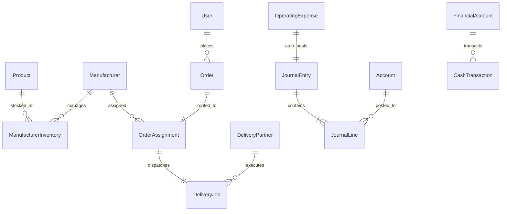

# DATABASE_SCHEMA.md — Single Source of Truth for Database Architecture

**Repository Path**: `backend/prisma/schema.prisma`  
**Database System**: MySQL 8.0  
**ORM Engine**: Prisma Client (`@prisma/client`)  
**Total Active Prisma Models**: 39  
**Last Updated**: September 14, 2026  

---

## Executive Overview

The database schema forms the relational core of the **Aama Clothings** Enterprise E-Commerce platform, powering consumer shopping, automated order allocation, regional factory dispatch, courier logistics, 13% Nepal VAT compliance, operating expense management, and double-entry GAAP/IFRS financial accounting.

### Schema Maintenance Policy
> [!IMPORTANT]
> This single file (`SCHEMA.md`) is the authoritative reference for the database schema. Any changes to `backend/prisma/schema.prisma` must be reflected directly in this document.

### Unused Schema Removals & Clean-Up
1. **Removed Unused Table**: `MonthlyExpense` (dropped; fully superseded by `OperatingExpense`).
2. **Removed Deprecated Column**: `Manufacturer.commissionRate` (dropped; manufacturer partners operate strictly on 100% Agreed Supply COGS).
3. **Optimized B-Tree Indexes**: Added secondary indexes across high-traffic query targets (`Order`, `CashTransaction`, `Product`, `AccountPayable`, `AccountReceivable`, `OperatingExpense`).

---

## Domain Entity Model Catalog

### 1. E-Commerce Storefront & Order Domain

#### `User`
- **Primary Key**: `id` (UUID)
- **Fields**:
  - `id`: String `@id @default(uuid())`
  - `firstName`: String? `@default("")`
  - `lastName`: String? `@default("")`
  - `phone`: String? `@default("")`
  - `name`: String
  - `email`: String `@unique`
  - `password`: String (Bcrypt Hash)
  - `cartData`: Json `@default("{}")`
  - `addresses`: Json `@default("[]")`

#### `Product`
- **Primary Key**: `id` (UUID)
- **Fields**:
  - `id`: String `@id @default(uuid())`
  - `name`: String
  - `description`: String `@db.Text`
  - `price`: Float
  - `image`: Json
  - `category`: String
  - `subCategory`: String
  - `sizes`: Json
  - `colors`: Json `@default("[]")`
  - `variants`: Json `@default("[]")`
  - `bestseller`: Boolean `@default(false)`
  - `newInStore`: Boolean `@default(false)`
  - `isSpecialOffer`: Boolean `@default(false)`
  - `offerTag`: String? `@default("")`
  - `offerEndDate`: DateTime?
  - `discount`: Float `@default(0)`
  - `costPrice`: Float `@default(0)` (Manufacturer Agreed COGS)
  - `stockQuantity`: Int `@default(0)`
  - `lowStockThreshold`: Int `@default(5)`
  - `published`: Boolean `@default(true)`
  - `date`: BigInt (Epoch timestamp ms)
- **Indexes**:
  - `@@index([published])`
  - `@@index([category])`
  - `@@index([bestseller])`

#### `Order`
- **Primary Key**: `id` (UUID)
- **Fields**:
  - `id`: String `@id @default(uuid())`
  - `userId`: String
  - `items`: Json
  - `amount`: Float
  - `address`: Json
  - `status`: String `@default("Order Placed")`
  - `paymentMethod`: String
  - `payment`: Boolean `@default(false)`
  - `date`: BigInt
  - `loyaltyDiscount`: Float? `@default(0)`
  - `rewardApplied`: Json?
  - `fulfillmentStatus`: String `@default("PENDING_ASSIGNMENT")`
  - `assignmentId`: String?
  - `deliveryJobId`: String?
  - `orderType`: String `@default("ONLINE_STORE")`
  - `directOrderType`: String? `@default("")`
  - `manufacturerId`: String?
  - `directNotes`: String? `@db.Text`
- **Indexes**:
  - `@@index([fulfillmentStatus])`
  - `@@index([userId])`
  - `@@index([orderType])`
  - `@@index([manufacturerId])`
  - `@@index([date])`
  - `@@index([status])`
  - `@@index([payment])`

#### Admin Direct-Order Identity Metadata
- `User.socialCustomerCode` is the customer-provided verification secret used with a normalized phone number for social-order account linking.
- `User.socialCustomerPhone` supports inactive social profiles and phone matching.
- `Order.rewardApplied` stores the immutable order-time decision, including `socialCodeVerified`, `loyaltyExcluded`, and `giftEligible`.
- Orders created after a code mismatch use a unique anonymous `userId` and remain intentionally detached from the matched account. Their dispatch address may be copied from a previous order, but their spend and order count must not be included in customer loyalty calculations.

#### Auxiliary Lookups & Marketing Models
- **`Category`**: `id` (UUID), `name` (String `@unique`)
- **`SubCategory`**: `id` (UUID), `name` (String `@unique`)
- **`Color`**: `id` (UUID), `name` (String `@unique`)
- **`Review`**: `id`, `productId`, `userId`, `userName`, `userEmail`, `rating` (1-5), `title`, `comment`, `likes`, `dislikes`, `verified`, `date`
- **`ShippingConfig`**: `id` (`"default"`), `baseCity`, `sameCityFee`, `differentCityFee`, `freeShippingMin`, `updatedAt`
- **`CustomerLevel`**: `id`, `levelNumber` `@unique`, `name`, `badgeIcon`, `minSpend`, `minOrders`, `rewardType`, `rewardValue`, `freeShipping`, `discountAmount`, `giftAmount`
- **`CustomerLetterImage`**: `id`, `userId`, `userEmail`, `imageUrl`, `title`, `notes`, `orderId`, `createdAt`
- **`SpecialOffer`**: `id`, `title`, `subtitle`, `badgeText`, `bannerImage`, `startDate`, `endDate`, `isActive`, `discount`, `productIds`
- **`StockLog`**: `id`, `productId`, `productName`, `variantLabel`, `previousQty`, `newQty`, `changeQty`, `reason`, `note`, `orderId`, `source`, `createdAt`
- **`InboundShipment`**: `id`, `batchNumber` `@unique`, `supplierName`, `invoiceNumber`, `carrier`, `shipmentDate`, `totalFreightCost`, `customsOrTaxes`, `totalItemsCost`, `totalLandedCost`, `paidAmount`, `payableAmount`, `paymentStatus`, `items`
- **`Admin`**: `id`, `email` `@unique`, `password` (Bcrypt), `createdAt`, `updatedAt`

---

### 2. Operating & Overhead Expenses Domain

#### `OperatingExpense`
- **Primary Key**: `id` (UUID)
- **Fields**:
  - `id`: String `@id @default(uuid())`
  - `title`: String
  - `category`: String (`MARKETING` | `RENT` | `ELECTRICITY` | `SALARIES` | `UTILITIES` | `MISCELLANEOUS` | `MAINTENANCE`)
  - `amount`: Float (Total expense amount)
  - `isVatBill`: Boolean `@default(false)`
  - `vatAmount`: Float `@default(0)` (Embedded 13% Input VAT)
  - `date`: DateTime `@default(now())`
  - `paymentMethod`: String (`CASH` | `BANK_TRANSFER` | `QR_PAYMENT` | `CREDIT`)
  - `vendorName`: String?
  - `invoiceNumber`: String?
  - `notes`: String? `@db.Text`
  - `createdBy`: String `@default("ADMIN")`
- **Indexes**:
  - `@@index([category])`
  - `@@index([date])`
  - `@@index([isVatBill])`

---

### 3. Distributed Manufacturing & Delivery Logistics Hub Domain

#### `Manufacturer`
- **Primary Key**: `id` (UUID)
- **Fields**:
  - `id`: String `@id @default(uuid())`
  - `name`: String
  - `email`: String `@unique`
  - `password`: String (Bcrypt)
  - `phone`: String
  - `city`: String (Regional city hub: Kathmandu, Pokhara, Biratnagar, etc.)
  - `address`: String? `@db.Text`
  - `qualityRating`: Float `@default(5.0)`
  - `ratingCount`: Int `@default(0)`
  - `isActive`: Boolean `@default(true)`
  - `isAvailable`: Boolean `@default(true)`
  - `contractStatus`: String `@default("ACTIVE")`
  - `contractDocUrl`: String? `@db.Text`
  - `contractStartDate`: DateTime?
  - `contractExpiryDate`: DateTime?
  - `agreementNotes`: String? `@db.Text`
  - `totalOrdersFulfilled`: Int `@default(0)`
  - `onTimeCount`: Int `@default(0)`
  - `defectCount`: Int `@default(0)`
  - `rejectionCount`: Int `@default(0)`
- **Indexes**:
  - `@@index([city])`
  - `@@index([isActive, isAvailable])`

#### `ManufacturerInventory`
- **Primary Key**: `id` (UUID)
- **Fields**:
  - `id`: String `@id @default(uuid())`
  - `manufacturerId`: String
  - `productId`: String
  - `productName`: String
  - `quantity`: Int `@default(0)`
  - `reservedQty`: Int `@default(0)`
  - `variantsStock`: Json `@default("[]")`
  - `proposedCostPrice`: Float?
  - `agreedCostPrice`: Float?
  - `priceStatus`: String `@default("PENDING")`
  - `priceNote`: String? `@db.Text`
  - `adminFeedback`: String? `@db.Text`
- **Constraints**:
  - `@@unique([manufacturerId, productId])`
- **Indexes**:
  - `@@index([productId])`
  - `@@index([manufacturerId])`

#### `OrderAssignment`
- **Primary Key**: `id` (UUID)
- **Fields**: `id`, `orderId` `@unique`, `manufacturerId`, `status` (`PENDING_ACCEPTANCE` | `ACCEPTED` | `MANUFACTURING` | `QUALITY_CHECK` | `PACKED` | `READY_FOR_PICKUP` | `PICKED_UP` | `REJECTED`), `assignedAt`, `acceptedAt`, `readyAt`, `pickedUpAt`, `rejectionReason`

#### `DeliveryPartner` & `DeliveryJob`
- **`DeliveryPartner`**: `id`, `name`, `email` `@unique`, `password`, `phone`, `city`, `vehicleType`, `licenseNumber`, `isActive`, `isAvailable`, `rating`, `totalDeliveries`, `onTimeDeliveries`, `failedDeliveries`
- **`DeliveryJob`**: `id`, `assignmentId` `@unique`, `deliveryPartnerId`, `orderId`, `pickupCity`, `dropoffCity`, `status` (`ASSIGNED` | `ACCEPTED` | `AT_PICKUP` | `PICKED_UP` | `IN_TRANSIT` | `DELIVERED` | `FAILED`), `codAmount`, `codCollected`, `proofOfDelivery`, `deliveredAt`

---

### 4. Double-Entry Accounting & Financial Ledger Subdomain

#### `Account` (Chart of Accounts)
- **Primary Key**: `id` (UUID)
- **Fields**: `id`, `accountCode` `@unique`, `accountName`, `accountType` (`ASSET` | `LIABILITY` | `EQUITY` | `REVENUE` | `EXPENSE`), `normalBalance` (`DEBIT` | `CREDIT`), `parentAccountId`, `currentBalance`, `isSystemAccount`
- **Indexes**:
  - `@@index([accountType])`
  - `@@index([parentAccountId])`

#### `JournalEntry` & `JournalLine`
- **`JournalEntry`**: `id`, `journalNumber` `@unique`, `transactionDate`, `fiscalYearId`, `accountingPeriodId`, `sourceType`, `sourceId`, `idempotencyKey` `@unique`, `totalDebit`, `totalCredit`, `status` (`POSTED` | `REVERSED`)
- **`JournalLine`**: `id`, `journalEntryId`, `accountId`, `debit`, `credit`, `description`, `customerId`, `supplierId`, `productId`
- **Indexes**:
  - `JournalEntry`: `@@index([transactionDate])`, `@@index([sourceType, sourceId])`, `@@index([status])`
  - `JournalLine`: `@@index([journalEntryId])`, `@@index([accountId])`

#### Treasury & Cash Flow Models
- **`FinancialAccount`**: `id`, `accountName` `@unique`, `accountType` (`CASH` | `BANK` | `WALLET` | `ESCROW`), `currentBalance`, `currency`, `isDefault`, `status`
- **`CashTransaction`**: `id`, `date`, `amount`, `type` (`INFLOW` | `OUTFLOW` | `TRANSFER`), `fromAccountId`, `toAccountId`, `category` (`SALES` | `SUPPLIER_PAYMENT` | `EXPENSE` | `CAPITAL_INJECTION` | `DRAWINGS` | `LOAN_DISBURSEMENT` | `LOAN_REPAYMENT` | `ASSET_PURCHASE` | `REFUND` | `INTERNAL_TRANSFER`), `partyName`, `invoiceNumber`
  - **Indexes**: `@@index([date])`, `@@index([category])`, `@@index([type])`

#### Capital, Debt & Tax Compliance Models
- **`FixedAsset`**: Fixed asset cost tracking, WDV/Straight-line depreciation, purchase date, accumulated depreciation, book value.
- **`PartnerEquity`**: Cap table partner shares, ownership %, initial capital, current capital, drawings.
- **`CompanyValuation`**: Round name, pre/post-money valuation, total shares, share price.
- **`ShareTransaction`**: Primary issuance / secondary equity transfers.
- **`ProfitDistribution`**: Fiscal year net profit breakdown, 20% retained earnings reinvestment, partner dividend payouts.
- **`InvestorLiability`**: Loan principal, interest APR, monthly EMI schedule, outstanding balance.
- **`CustomerReturn` & `SupplierReturn`**: Customer refund processing (restock vs write-off) & supplier credit notes.
- **`TaxConfiguration` & `TaxFilingRecord`**: IRD Nepal 13% VAT filing logs, taxable sales/purchases, output/input VAT, net VAT payable.
- **`AccountPayable` & `AccountReceivable`**: Unpaid vendor invoices & customer receivables.
  - **Indexes**: `@@index([status])`, `@@index([dueDate])`, `@@index([category])`

---

## Entity Relationship Topology

---

## Performance & Optimization Guidelines

1. **JSON Column Defensive Parsing**: Application controllers parse `JSON` fields (`items`, `variants`, `addresses`) using defensive helper fallbacks to guarantee non-breaking execution.
2. **BigInt Epoch Timestamps**: `Product.date`, `Order.date`, and `Review.date` store 64-bit epoch milliseconds. Controllers auto-serialize `BigInt` to JavaScript Numbers/Strings before sending JSON HTTP responses.
3. **Double-Entry Balance Constraint**: Every `JournalEntry` requires `totalDebit === totalCredit` before being committed to the ledger.
4. **Capital Solvency Enforcement**: Outflow operations on `FinancialAccount` require `currentBalance >= transferAmount`, preventing unbacked liquid cash disbursements.
